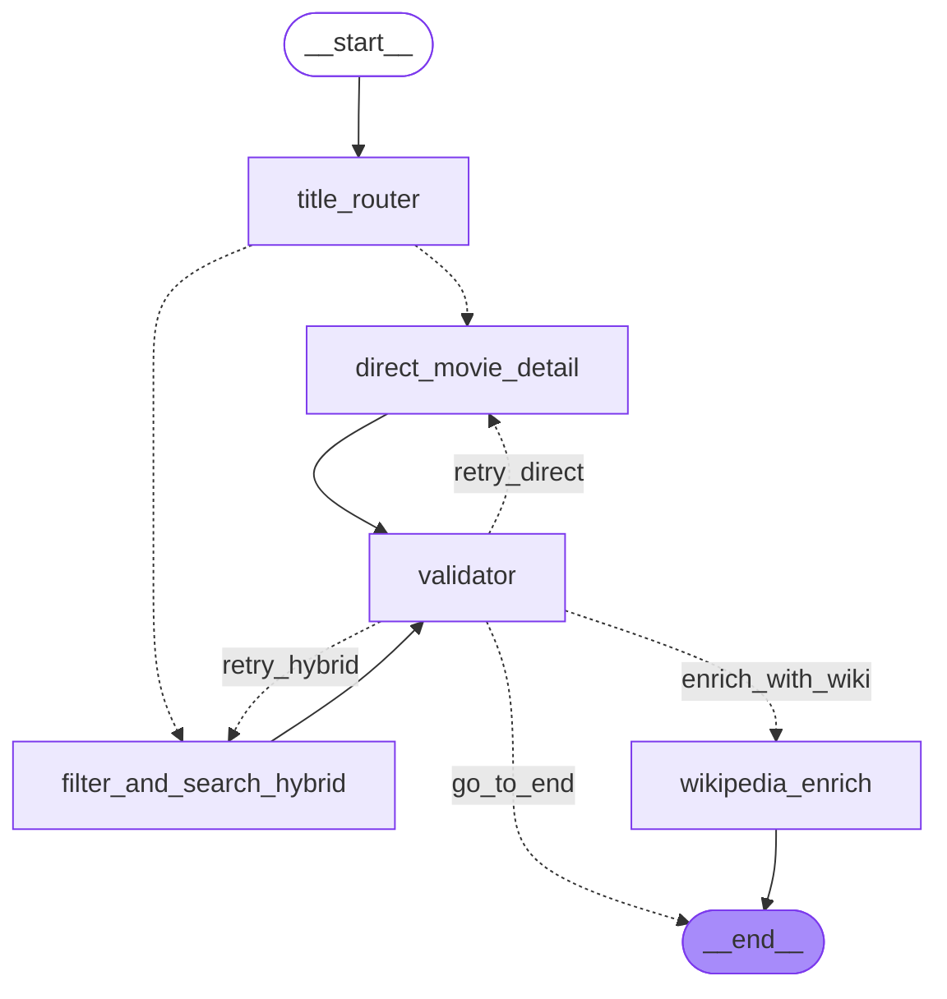

# HorRAGor 🎬 — Agent Corrective RAG (CRAG) pour le Cinéma d'Horreur

HorRAGor est un agent conversationnel spécialisé dans le cinéma d'horreur, conçu avec **LangGraph** et architecturé selon le paradigme **Corrective RAG (CRAG)**. 

Plutôt que d'exécuter un pipeline de recherche linéaire, l'agent intègre un nœud d'évaluation qualité (*Output Guardrails*) capable de détecter les hallucinations ou les manques d'informations du LLM, afin de déclencher de manière autonome des boucles de rétroaction locales ou des enrichissements via l'API Wikipédia.

---

## 📐 Architecture du Graphe

L'agent repose sur un graphe d'état cyclique (`StateGraph`) qui évite de recalculer l'intégralité du flux en cas d'erreur de génération, en ciblant une correction locale.



### Fonctionnement des branches et boucles :
1. **Routage Initial** (title_router) : Analyse la requête pour déterminer si l'utilisateur cible un film précis (recherche directe) ou s'il exprime des critères (recherche hybride SQL + FAISS).

2. **Validation Métier** (validator) : Un LLM structuré évalue la réponse générée après l'exécution des nœuds de recherche.

3. **Correction Locale** (retry_direct / retry_hybrid) : Si le LLM a halluciné ou répondu à côté, le validateur renvoie le flux uniquement sur le nœud de génération concerné sans réinitialiser tout l'état ni repasser par le routeur.

4. **Enrichissement Externe** (wikipedia_enrich) : Si la réponse est correcte mais que le synopsis est absent ou incomplet en base locale, l'agent interroge l'outil Wikipédia, reconstruit le contexte, régénère la réponse et termine le flux.

5. **Court-circuit Vide** (no_movies_end) : Si aucune donnée n'est trouvée en base, l'agent coupe court vers la fin pour éviter des appels LLM inutiles.

## 📦 Structure des Données d'État (AgentState)
L'état partagé entre tous les nœuds maintient une cohérence stricte :
- `user_query` (str) : Requête brute de l'utilisateur.

- `current_step` (str) : Jeton de routage mis à jour dynamiquement pour piloter les aiguillages conditionnels.

- `retrieved_movies` (List[Movie]) : Liste des objets films extraits de la base SQL/FAISS.
- `answer` (str) : La réponse textuelle en cours de validation ou finale.

- `steps` (List[AgentStep]) : Historique et traçabilité de l'exécution (audit trail).

## 🚀 Utilisation et Appel de l'Agent
L'agent est entièrement configuré et compilé dans agents/graph.py. Son invocation s'effectue simplement en lui passant l'état initial.

Exemple d'appel programmatique (ex: Intégration FastAPI ou Script)

```python
# run_agent_service.py (ou au sein de ton routeur d'API)

from typing import Dict, Any
from agents.graph import graph
from api.schemas import ChatFilters, AgentState, ChatResponse, FilmShort

def run_agent(query: str, filters: ChatFilters = None) -> ChatResponse:
    """
    Invoque le graphe HorRAGor de bout en bout avec des limites de récursion
    en se conformant strictement aux schémas de données de l'API.
    
    Args:
        query (str): La question brute de l'utilisateur.
        filters (ChatFilters, optional): Les filtres issus du formulaire front-end.
        
    Returns:
        ChatResponse: L'objet Pydantic standardisé pour la réponse de l'endpoint /chat.
    """
    # 1. Préparation de l'état initial selon la structure de la classe AgentState de l'API
    initial_state = AgentState(
        user_query=query,
        current_step=None,
        retrieved_movies=[],  # Initialisé vide, sera peuplé de FilmShort par les nœuds
        answer=None
    )
    
    # Injection dynamique de l'attribut 'steps' si ton architecture LangGraph s'appuie 
    # dessus en interne mais qu'il n'est pas déclaré dans le schéma AgentState strict de l'API
    if not hasattr(initial_state, "steps"):
        initial_state.__dict__["steps"] = []
    
    # 2. Configuration des Guardrails d'exécution (Évite les boucles infinies)
    config = {"recursion_limit": 10}
    
    # 3. Invocation du graphe compilé
    final_state = graph.invoke(initial_state, config=config)
    
    # 4. Extraction et conversion selon le schéma de sortie ChatResponse
    # On extrait l'historique des étapes (steps) stocké durant le run
    steps_executed = final_state.__dict__.get("steps", [])
    
    # Les films récupérés au cours du graphe font office de recommandations
    # Ils sont déjà typés ou convertis en FilmShort par les nœuds direct_movie_detail ou hybrid
    recommendations_list = final_state.get("retrieved_movies", [])
    
    # Construction de la réponse typée Pydantic
    return ChatResponse(
        answer=final_state.get("answer") or "Désolé, je n'ai pas pu générer de réponse.",
        steps=steps_executed,
        recommendations=recommendations_list
    )


# ==============================================================================
# EXEMPLE DE SIMULATION D'APPEL (ENDPOINT /CHAT)
# ==============================================================================
if __name__ == "__main__":
    print("🤖 Test de l'appelant de l'agent avec les schémas de Hanna...\n")
    
    # Simulation de filtres reçus depuis l'interface Streamlit
    simulation_filters = ChatFilters(
        release_year_min=1970,
        release_year_max=1990,
        tmdb_score_min=7.5
    )
    
    # Invocation de l'agent
    chat_output = run_agent(
        query="Dis-m'en plus sur le film Alien de Ridley Scott ?",
        filters=simulation_filters
    )
    
    # Validation de la structure de sortie
    print("─" * 60)
    print(f"💬 RÉPONSE FINALE APPORTÉE :\n{chat_output.answer}\n")
    print("─" * 60)
    print("📋 TRACE D'EXÉCUTION DU GRAPHE :")
    for s in chat_output.steps:
        print(f"  • [{s.step}] -> {s.status}")
        
    print("\n🎯 FILMS RECOMMANDÉS (TOP) :")
    for movie in chat_output.recommendations:
        print(f"  • {movie.title} ({movie.release_date or 'Année inconnue'}) - Note: {movie.tmdb_score}/10")
    print("─" * 60)
```